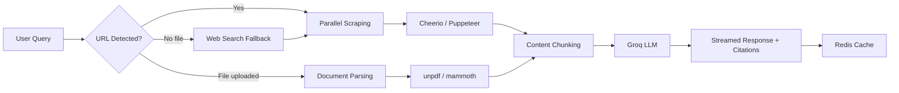

# DeepCite

AI answer engine with source attribution. Scrape websites, parse PDFs/DOCX files, and get answers backed by cited sources — powered by Groq's Llama 3.3 70B.


## Architecture



## Features

- **Multi-URL analysis** — Paste up to 5 URLs, scraped in parallel with Cheerio (fast) or Puppeteer (SPA fallback)
- **PDF & DOCX parsing** — Upload documents or link to them; parsed with unpdf and mammoth
- **Web search fallback** — When no URLs are provided, Serper API auto-discovers relevant sources
- **Streaming responses** — Token-by-token streaming with pipeline status indicators
- **Source attribution** — Every response shows which sources were used, with scraper type and status
- **Markdown rendering** — AI responses rendered with full markdown support (GFM, code blocks, tables)
- **Redis caching** — Scraped content cached for 1 hour (optional, graceful degradation)
- **Rate limiting** — In-memory rate limiter on API routes (20/min chat, 10/min upload)
- **Local persistence** — Chat history saved to localStorage with migration from legacy keys
- **Export** — Download conversation as markdown
- **Mobile responsive** — Full-width layout on small screens, sticky input bar

## Tech Stack

| Layer | Technology | Why |
|-------|-----------|-----|
| Framework | Next.js 15 (App Router) | Server components, API routes, streaming |
| UI | React 19 + Tailwind CSS | Component model + utility-first styling |
| LLM | Groq SDK (Llama 3.3 70B) | Fast inference, streaming support |
| Scraping | Cheerio + Puppeteer | Static-first with SPA fallback |
| Documents | unpdf + mammoth | PDF and DOCX text extraction |
| Cache | Upstash Redis (optional) | Serverless-compatible KV store |
| Search | Serper API (optional) | Google search results for auto-sourcing |
| Validation | @t3-oss/env-nextjs + Zod | Build-time environment validation |
| Testing | Vitest + Testing Library | Fast unit/component/hook tests |

## Setup

```bash
# Clone and install
git clone https://github.com/smear6uard/DeepCite.git
cd DeepCite
npm install

# Configure environment
cp .env.example .env
# Edit .env — only GROQ_API_KEY is required

# Development
npm run dev

# Production
npm run build && npm start
```

### Environment Variables

| Variable | Required | Description |
|----------|----------|-------------|
| `GROQ_API_KEY` | Yes | Groq API key for LLM inference |
| `UPSTASH_REDIS_REST_URL` | No | Upstash Redis URL for caching |
| `UPSTASH_REDIS_REST_TOKEN` | No | Upstash Redis token |
| `SERPER_API_KEY` | No | Serper API key for web search fallback |

## Testing

```bash
npm test          # Watch mode
npm run test:run  # Single run (CI)
```

36 tests across 8 test files covering:
- **Unit tests** — utils, document parser, Groq client
- **Component tests** — ChatHeader, ChatInput, ChatMessage
- **Hook tests** — useLocalStorage, useTypewriter

## Project Structure

```
src/
├── __tests__/           # Vitest test suites
├── app/
│   ├── api/chat/        # Streaming chat endpoint
│   ├── api/upload/      # File upload endpoint
│   ├── layout.tsx       # Root layout with ErrorBoundary + ToastProvider
│   ├── page.tsx         # ~90-line thin shell composing hooks + components
│   └── globals.css      # CSS variables + base styles
├── components/
│   ├── chat/            # ChatMessage, ChatInput, ChatHeader, SourcePanel,
│   │                    # SourceCard, StreamingIndicator, EmptyState, FileUploadOverlay
│   └── ui/              # ErrorBoundary, GrainOverlay, Skeleton
├── context/             # ToastContext
├── hooks/               # useChat, useFileUpload, useLocalStorage,
│                        # useTypewriter, useAutoScroll
├── lib/                 # groqClient, scrapers, documentParser,
│                        # cache, webSearch, constants, utils
├── types/               # Shared TypeScript interfaces
├── env.ts               # Zod-validated environment variables
└── middleware.ts         # Rate limiting
```

## Architecture Decisions

- **Monolith decomposition**: Original 914-line `page.tsx` refactored into 8 components, 5 hooks, and shared types — page.tsx is now ~90 lines of pure composition
- **Tailwind over inline styles**: All `style={{}}` converted to Tailwind classes using extended design tokens matching the terminal aesthetic
- **Streaming architecture**: Server streams raw text chunks; client handles structured event parsing for status updates
- **Graceful degradation**: Redis caching and web search are optional — app works fully with just a Groq API key
- **Build-time validation**: `@t3-oss/env-nextjs` fails fast if `GROQ_API_KEY` is missing, preventing runtime surprises

## License

MIT
